# Exploring the UniProt protein knowledgebase with AWS Open Data and Amazon Neptune

<br><br>
<div style="display:flex;flex-wrap:wrap;padding:0 4px">
  <div style="flex:20%;padding:0 10px">
      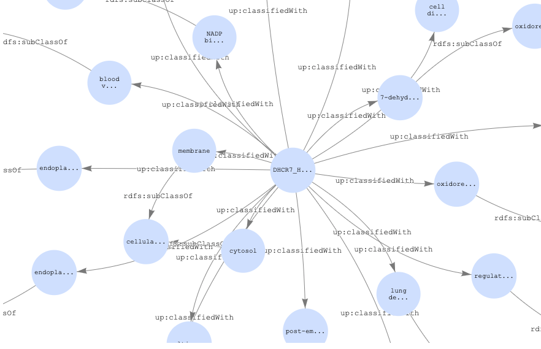
  </div>

</div>

## Description
The [Universal Protein Resource (UniProt)](https://www.uniprot.org/) is a widely used resource of protein data that is now available through the Registry of Open Data on AWS. Its centerpiece is the [UniProt Knowledgebase (UniProtKB)](https://www.uniprot.org/help/uniprotkb), a central hub for the collection of functional information on proteins, with accurate, consistent and rich annotation. UniProtKB data is highly structured with many relationships between protein sequences, annotations, ontologies and other related data sources. UniProt can be directly accessed via the [UniProt website](https://www.uniprot.org/) and is available for bulk downloads in several formats, including RDF which is particularly well suited to represent the complex and connected nature of the data as a graph. Creating a custom knowledge base can enable more advanced use cases, such as joining with other data sources, augmenting data with custom annotations and relationships, or inferring new relationships with analytics or machine learning.

In this example, we will demonstrate the step-by-step process to create and use your own protein knowledge base using UniProt RDF data. We will show how to ingest a subset of UniProtKB data into your own Amazon Neptune database directly from the Registry of Open Data on AWS. We will then show how to query the data with SPARQL, create new relationships in the data and visualise the data as a graph.


## How to run this example

If you would like to try this example yourself, there is a cloud formation stack that can be run within your own AWS account. If your region is not listed, you can modify the launch link and replace with your region.

| Region | Launch Template |
|-|-|
| Europe (Paris) *eu-west-3* |[](https://console.aws.amazon.com/cloudformation/home?region=eu-west-3#/stacks/new?stackName=Explore-UniProtKB-with-Amazon-Neptune&templateURL=https://s3.amazonaws.com/aws-wwps-apj-iss-public-samples/explore-uniprotkb-with-amazon-neptune/UniProtKB.template)|
| US East (N. Virginia) *us-east-1* |[](https://console.aws.amazon.com/cloudformation/home?region=us-east-1#/stacks/new?stackName=Explore-UniProtKB-with-Amazon-Neptune&templateURL=https://s3.amazonaws.com/aws-wwps-apj-iss-public-samples/explore-uniprotkb-with-amazon-neptune/UniProtKB.template)|
| Asia Pacific (Singapore) *ap-southeast-1* |[](https://console.aws.amazon.com/cloudformation/home?region=ap-southeast-1#/stacks/new?stackName=Explore-UniProtKB-with-Amazon-Neptune&templateURL=https://s3.amazonaws.com/aws-wwps-apj-iss-public-samples/explore-uniprotkb-with-amazon-neptune/UniProtKB.template)|
| Asia Pacific (Sydney) *ap-southeast-2* |[](https://console.aws.amazon.com/cloudformation/home?region=ap-southeast-2#/stacks/new?stackName=Explore-UniProtKB-with-Amazon-Neptune&templateURL=https://s3.amazonaws.com/aws-wwps-apj-iss-public-samples/explore-uniprotkb-with-amazon-neptune/UniProtKB.template)|

The cloud formation stack will create the following resources:

- A VPC with Subnets, Internet Gateway, NAT Gateway, Routing Tables, and Security Groups 
- The NeptuneDB cluster and instance
- An IAM role used to load data from the AWS Open Data Registry
- An S3 VPC endpoint for Neptune to access the open data bucket
- An Amazon SageMaker notebook to load the data and query the database

The resources provisioned via the CloudFormation stack are shown in the below diagram:

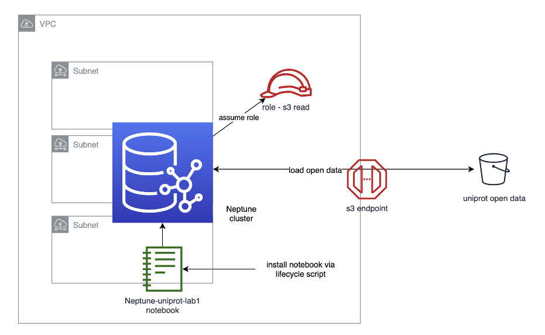

The total time to run the lab is approximately one hour. To load the dataset into the Neptune instance as quickly as possible, we use a large writer instance *db.r5.8xlarge* which is not covered by the AWS free tier. This will cost approximately 9 USD. Once the data is loaded we should switch to a smaller instance to minimize costs. Here is a detailed cost estimation for loading data in the eu-west-3 region:

  | Item | Unit Price  | Unit | Cost |
  | ----------- | ----------- | ----------- | ----------- |
  | Instance hour (db.r5.8xlarge) | 6.456 per hour    | 1 | 6.456 |
  | Storage IO Usage | 0.22 per million IO     | 10  | 2.2 |
  | Storage Usage | 0.11 per GB per month    | 0.1 | 0.01 |

The actual costs will vary depending on region, but will be comparable. We will look more into loading times below. For more information on the costs for running Neptune, go [here](https://aws.amazon.com/neptune/pricing/).

### Open the Neptune Workstation Notebook 
Once we have run the Cloud Formation template, we can open the [Neptune Workbench Notebook](https://docs.aws.amazon.com/neptune/latest/userguide/graph-notebooks.html) that was created. From the Neptune console, click on Notebooks, select the notebook, and then click the Open Notebook button.
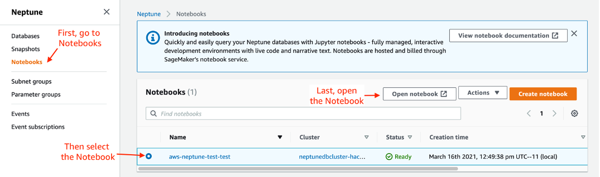

### Registry of Open Data on AWS
The [Registry of Open Data](https://registry.opendata.aws/) on AWS makes it easy to find datasets made publicly available through AWS services. UniProt is made available through the Registry of Open Data via the [Open Data Sponsorship Program](https://aws.amazon.com/opendata/open-data-sponsorship-program/), which covers the cost of storage for publicly available high-value cloud-optimized datasets. UniProt is available in the registry as [RDF](https://www.w3.org/RDF/) files, a standard model for data interchange on the Web that is capable of capturing complex relationships within the data of the UniProtKB. To look for other datasets or learn more on publishing datasets, visit the [registry of open data on AWS](https://registry.opendata.aws/).

### Amazon Neptune
[Amazon Neptune](https://aws.amazon.com/neptune/) is a fast, reliable, fully managed graph database service that makes it easy to build and run applications that work with highly connected datasets. The core of Neptune is a purpose-built, high-performance graph database engine. This engine is optimized for storing billions of relationships and querying the graph with milliseconds latency. Neptune supports the popular graph query languages [Apache TinkerPop Gremlin](https://tinkerpop.apache.org/gremlin.html) and [W3C’s SPARQL](https://www.w3.org/TR/sparql11-overview/), enabling you to build queries that efficiently navigate highly connected datasets.

### Creating a custom UniProtKB
In this example, we select a list of UniProt RDF files that we are interested in exploring. Then we ingest the RDF files from the Open Data Registry on AWS into Amazon Neptune DB. Once the data is ingested, we demonstrate how to query relationships and attributes. By adapting this example to your own research needs, you should be able to build a subset of UniProtKB containing data for your specific use case. This example will also be the foundation of our follow-on example where we will use [Neptune ML](https://docs.aws.amazon.com/neptune/latest/userguide/machine-learning.html) to predict relationships and attributes in the UniProtKB.

## Brief overview of UniProt data
UniProt RDF files are located in a public S3 bucket `s3://aws-open-data-uniprot-rdf`. There are different paths for each data release. New data releases typically happen every two months, so be sure to use the latest release directory. We use the first release of 2021, which has a path of `s3://aws-open-data-uniprot-rdf/2021-01`. For more information on the data, go to the [UniProt help pages](https://www.uniprot.org/help/). Here is a brief description for some of the different datasets and files.

#### Taxonomy, Gene Ontology (GO) and other reference data
UniProt uses several supporting reference datasets that contain related information and metadata. Among these are the [NCBI taxonomy](https://www.ncbi.nlm.nih.gov/taxonomy), for the hierarchical classification of organisms, and the [Gene Ontology (GO)](http://geneontology.org/docs/introduction-to-go-resource/), used to describe the current scientific knowledge about the functions of proteins. The GO is represented with the [Web Ontology Language (OWL)](https://en.wikipedia.org/wiki/Web%5FOntology%5FLanguage), which is used to define ontologies that describe taxonomies and classification networks, essentially defining the structure of a knowledge graph. OWL is also built upon RDF.


| File      | Description |
| ----------- | ----------- |
| citations.rdf.gz     | Literature citations       |
| diseases.rdf.gz    | Human diseases        |
| journals.rdf.gz     | Journals which contain articles cited in UniProt       |
| taxonomy.rdf.gz   | Organisms        |
| keywords.rdf.gz     | Keywords       |
| go.rdf.gz   | Gene Ontology        |
| enzyme.rdf.gz      | Enzyme classification       |
| pathways.rdf.gz   | Pathways        |
| locations.rdf.gz     | Subcellular locations       |
| tissues.rdf.gz  | Tissues        |
| databases.rdf.gz    | Databases that are linked from UniProt       |
| proteomes.rdf.gz   | Proteomes        |

#### UniProt Knowledgebase (UniProtKB)
The UniProt Knowledgebase (UniProtKB) is the central hub for the collection of functional information on proteins, with accurate, consistent and rich annotation. In addition to capturing the core data mandatory for each UniProtKB entry (mainly, the amino acid sequence, protein name, taxonomic data and citation information), as much additional annotation as possible is added. This includes widely accepted biological ontologies, classifications and cross-references, and clear indications of the quality of annotation in the form of evidence attribution of experimental and computational data. The UniProtKB dataset is split into files based on the top levels of the [NCBI taxonomy](https://www.ncbi.nlm.nih.gov/taxonomy) (the file name indicates the classification and ID of the taxon) that contain at most 1 million protein entries. Obsolete entries are provided in separate files with at most 10 million entries (uniprotkb_obsolete_\*.rdf). For more information on the knowledgebase, see the [UniProtKB documentation](https://www.uniprot.org/help/uniprotkb).

#### UniProt Sequence archive (UniParc)
The UniProt Archive (UniParc) is a comprehensive and non-redundant database that contains most of the publicly available protein sequences in the world. Data is partitioned into files of around 1 Gigabyte in size depending on the size of the protein sequence. For more information on this archive, see the [UniParc documentation](https://www.uniprot.org/help/uniparc).

#### UniProt Reference clusters (UniRef)
The UniProt Reference Clusters (UniRef) provide clustered sets of sequences from the UniProtKB and selected UniParc records in order to obtain complete coverage of the sequence space at several resolutions while hiding redundant sequences. Unlike in UniParc, sequence fragments are merged in UniRef. The UniRef dataset is split into files that contain about 100,000 clusters each. For more information on reference clusters, see the [UniRef documentation](https://www.uniprot.org/help/uniref).

#### What does the data look like?
An RDF file is a document written in the Resource Description Framework (RDF) language, that was created to represent relationships between web resources. It’s also used to create ontologies for different domains. RDF contains information about an entity as structured metadata. RDF graphs contain statements with a subject, predicate and object, also known as a triple. The subject is the main actor, the predicate is the action or verb, and the object is what is acted upon. A triple can be used to associate a subject with a property or define a relationship between two subjects.

As an illustration, let’s look at how the taxonomy is represented in RDF. In the RDF listing, we see that [taxonomy 9606](https://www.uniprot.org/taxonomy/9606) is defined as Homo Sapiens. Taxonomy 9606 is a subclass of [taxonomy 9605](https://www.uniprot.org/taxonomy/9605), defined as Homininae. The subject is *taxonomy 9606*, the predicate is *subclass* and the object is *taxonomy 9605*. In addition, taxonomy 9606 has a narrower transitive relationship to [taxonomy 63221](https://www.uniprot.org/taxonomy/63221), defined as Homo sapiens neanderthalensis, as well as [taxonomy 741158](https://www.uniprot.org/taxonomy/741158), defined as Homo sapiens subsp. 'Denisova'. Expressed in RDF terms, the subject is *taxonomy 9606*, the predicate is *narrower transitive relationship* and the objects are *taxonomy 63221* and *taxonomy 741158*.

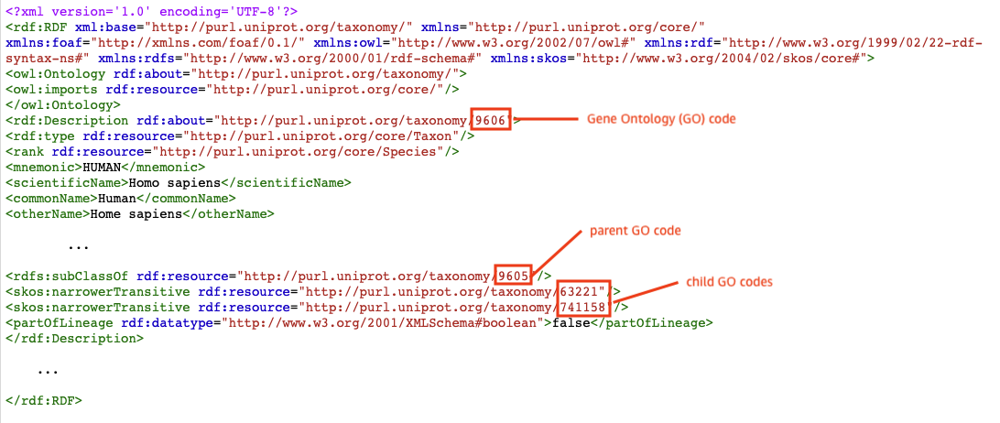

## Load the UniProt data
Instead of executing a large number of insert statements or other API calls, we use the [Amazon Neptune Bulk Loader](https://docs.aws.amazon.com/neptune/latest/userguide/bulk-load-data.html) to load a subset of UniProt RDF files directly from the public S3 bucket.

### Accessing the data
Before we can load data into the Neptune instance, we need an AWS Identity and Access Management (IAM) role that has access to the public bucket where the UniProt data resides. In addition, the Neptune loader requires a VPC endpoint for Amazon S3. For more information on bulk loading requirements, refer to the [Neptune documentation on bulk loading](https://docs.aws.amazon.com/neptune/latest/userguide/bulk-load.html). The IAM role and VPC endpoint have already been configured by our cloud formation template. We just need to define the role and endpoint settings.


```python
import os
iamRoleArn = os.environ['NEPTUNE_LOAD_FROM_S3_ROLE_ARN']
neptune_host = os.environ['GRAPH_NOTEBOOK_HOST']
neptune_port = os.environ['GRAPH_NOTEBOOK_PORT']
url = f'https://{neptune_host}:{neptune_port}/loader'
```

### Determine the files to load
The entire UniProt dataset is over 10 Terabytes uncompressed, and is growing rapidly. To save on time and cost, we only load the data that is relevant to our use case. Loading the complete UniProtKB will take around 74 hours, as the ingestion rate is around 6.6 GB per hour. The majority of loading cost is for the large DB writer instance. Using an r5.8xlarge, the cost is 6.46 USD per hour, so the cost of writing the entire UniProt dataset would be around 478 USD. For this example, we only load a single RDF file for Metazoa and the taxonomy and Gene Ontology files. This keeps our total loading time to under one hour, and the cost below 10 USD.
These are the files to load:
- **taxonomy.rdf.gz** - the taxonomy file
- **go.rdf.gz** - the Gene Ontology file
- **uniprotkb_eukaryota_opisthokonta_metazoa_33208_0.rdf.gz** - a single UniProtKB file for Metazoa


```python
import json
import urllib.request

# define a list of files to be loaded
files_to_load = [
    "s3://aws-open-data-uniprot-rdf/2021-01/supporting/taxonomy.rdf.gz",
    "s3://aws-open-data-uniprot-rdf/2021-01/supporting/go.rdf.gz",
    "s3://aws-open-data-uniprot-rdf/2021-01/uniprot/uniprotkb_eukaryota_opisthokonta_metazoa_33208_0.rdf.gz"
]
```

### Execute the bulk load command
Now we have all the information needed to execute the bulk load command. In the code below we define a function that:
1.	Creates a json string of parameters required by the bulk loader command
2.	Creates and sends an http request to the bulk loader endpoint
3.	Returns bulk load tracking IDs that will be used to track the loading process

We call this function for every file we wish to load. The entire loading process will take approximately 50 minutes. Times will vary depending on the region and the number and size of the datasets loaded.

Loading can also be accomplished with the %load command within the workbench. The load command works well for smaller files, but for loading large files, it makes it difficult to monitor the load process as it locks the entire notebook. 


```python
loadids = []

def loadfile(filelocation):
    data = {
      "source" : filelocation,
      "format" : "rdfxml",
      "iamRoleArn" : iamRoleArn,
      "region" : "eu-west-3",
      "failOnError" : "FALSE",
      "parallelism" : "OVERSUBSCRIBE",
      "queueRequest" : "TRUE"
    }

    data = json.dumps(data)

    req = urllib.request.Request(url = url, data = bytes(data.encode("utf-8")), method = "POST")

    req.add_header("Content-type", "application/json; charset=UTF-8")

    with urllib.request.urlopen(req) as resp:
        response_data = json.loads(resp.read().decode("utf-8"))
        loadId=response_data['payload']['loadId']
        
    print("load id: {}".format(loadId))
    loadids.append(loadId)
    return loadids
    
for file in files_to_load:
    loadids = loadfile(file)
```

    load id: 72d3e5e7-2182-48e4-a61c-0a2bf75c5e20
    load id: 98c4343e-f559-4ecc-929e-f530d6cd1a67
    load id: ddd5ebf0-3c2d-4ece-8a6b-c7faf7816817


### Monitor loading
Graph data comes in triples, which is the relationship between two nodes via an edge. Here are some metrics we captured during our previous load of the above files.

| File | File Size  | Triples | Approximate Load Time in Seconds |
| ----------- | ----------- | ----------- | ----------- |
| taxonomy.rdf.gz | 50.5MB   | 15950018 | 100 |
| go.rdf.gz | 3.3MB     | 381392  | 10 |
| uniprotkb_eukaryota_opisthokonta_metazoa_33208_0.rdf | 3.45GB   | 344412243 | 1900 |


Here is an estimation for a full load of all supporting files and UniProtKB data:

| File Directory | Number of Files | Total File Size  |  Approximate Load Time |
| ----------- | ----------- | ----------- |  ----------- |
| supporting/* |16   | 8.2 GB   | 1.25 hours |
| uniprot/*    | 275 | 482 GB   | 73 hours  |

Loading can take some time, so it's convenient to have a way to monitor the loading progress. The code below calls the Neptune endpoint with the load IDs we saved previously, and returns a status update on the bulk loading process for each file.


```python
import time
for load_id in loadids:
    req = urllib.request.Request(url = "/".join([url, load_id]), method = "GET")
    req.add_header("Content-type", "application/json; charset=UTF-8")
    
    status = None
    while status != 'LOAD_COMPLETED':
        with urllib.request.urlopen(req) as resp:
            response_data = json.loads(resp.read().decode("utf-8"))['payload']

        status = response_data['overallStatus']['status']
        totalTimeSpent = response_data['overallStatus']['totalTimeSpent']
        totalRecords = response_data['overallStatus']['totalRecords']
        end = '\n' if status == 'LOAD_COMPLETED' else '\r'
        print(f"{load_id}  status: {status} \tload time: {totalTimeSpent}s\trecords: {totalRecords}", end=end)
        time.sleep(1)
```

    72d3e5e7-2182-48e4-a61c-0a2bf75c5e20  status: LOAD_COMPLETED 	load time: 129s	records: 1595001818
    98c4343e-f559-4ecc-929e-f530d6cd1a67  status: LOAD_COMPLETED 	load time: 12s	records: 38139292
    ddd5ebf0-3c2d-4ece-8a6b-c7faf7816817  status: LOAD_COMPLETED 	load time: 2242s	records: 34441224343


### Downsize the Neptune instance

Once all the data is loaded, we no longer need a large writer instance, as we will mostly be reading from the database. It's recommended that you resize the Neptune database to a smaller instance after you finish loading the files to save on running costs.

From the Neptune Console, go to *Databases*, choose the Neptune Writer and then click *Modify*. 

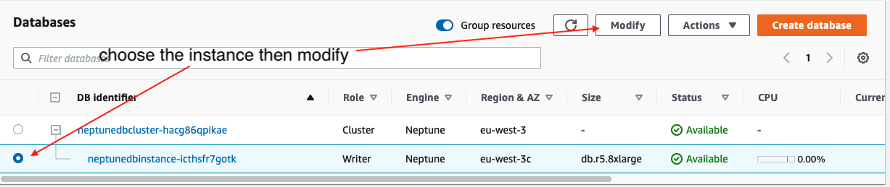

In the list of presented DB instance classes, select *db.r5.large*, the smallest instance available, and then click *Continue*.

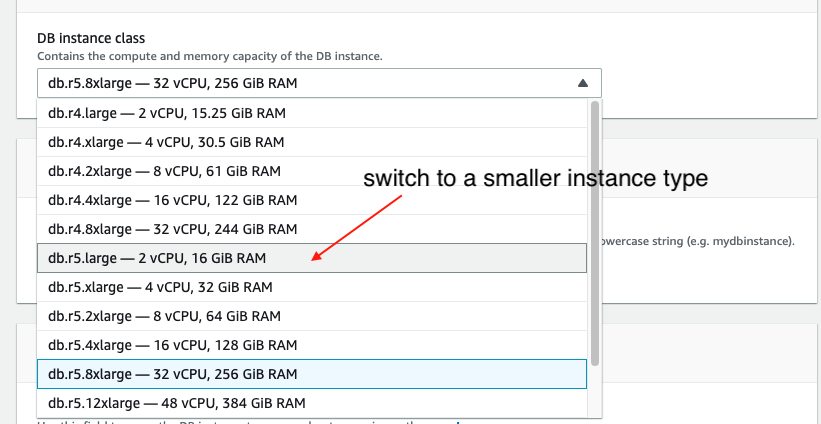
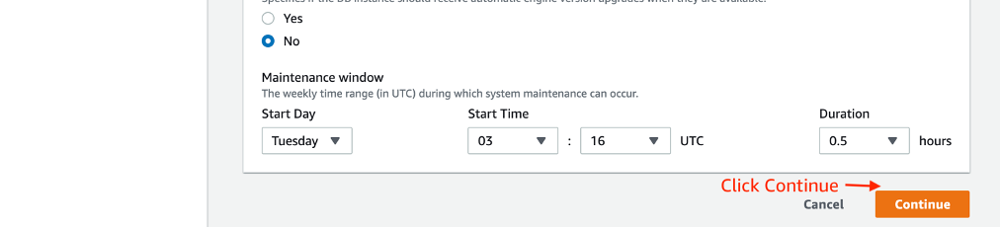

On the next page, choose *Apply immediately*, and click the *Modify DB Instance* button.

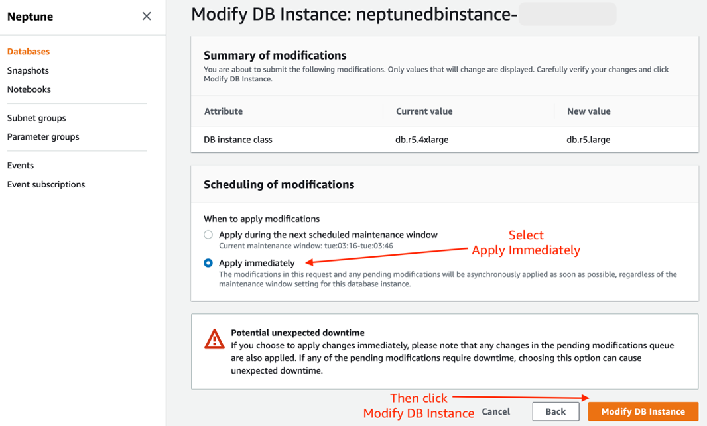

Your Neptune DB instance is now cost optimized for querying. For more information, refer to the steps in the [Neptune Developer Guide](https://docs.aws.amazon.com/neptune/latest/userguide/manage-console-modify.html#manage-console-modify-instance).

## Querying the UniProtKB
Now that we have the loaded the UniProt data, we can query it with SPARQL, a query language for graph data in RDF format. Amazon Neptune is compatible with SPARQL 1.1. If you are used to standard SQL queries, working with SPARQL should be familiar to you. A SPARQL query contains:
- Prefixes to abbreviate URIs
- Dataset declaration to specify the graphs being queried
- SELECT clause that determines which attributes to return
- WHERE clause that specifies matching criteria
- Query modifiers for ordering results

If you are unfamiliar with SPARQL queries, see [Writing Simple Queries](https://www.w3.org/TR/sparql11-query/#WritingSimpleQueries) or the full guide in the [SPARQL 1.1 Query Language documentation](https://www.w3.org/TR/sparql11-query/).

Let's do some example queries, so you can get an idea of how SPARQL works with UniProtKB.

### Example 1:  Simple Query

Let's start with a simple query. In this query, we will look within the taxonomy tree, to see if there are any subclass records under *Homo Sapiens*. *Homo Sapiens* are coded with a taxonomy id of [9606](https://www.uniprot.org/taxonomy/9606). Let's query the web URI and scientific name of the subclass records. 


```python
%%sparql
PREFIX rdfs: <http://www.w3.org/2000/01/rdf-schema#>
PREFIX taxon: <http://purl.uniprot.org/taxonomy/>
PREFIX up: <http://purl.uniprot.org/core/>
SELECT ?taxonomy ?scientific_name
WHERE {
    ?taxonomy a up:Taxon ;
             up:scientificName ?scientific_name ;
             rdfs:subClassOf taxon:9606 .
} 
```

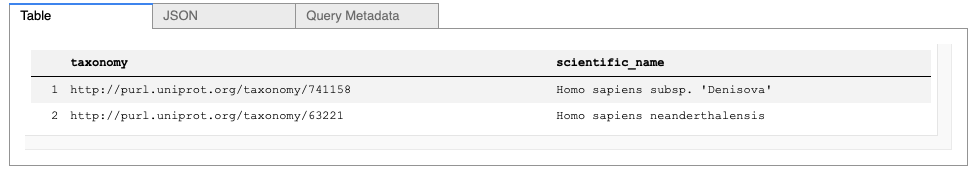


The query returns two records, *Homo Sapiens Neanderthalensis* and *Homo Sapiens Subsp. 'Denisova'* , which are found under the taxonomy of *Homo Sapiens*. For taxonomy identifiers of other organisms, you may trace from the top node of [cellular organisms](https://www.uniprot.org/taxonomy/131567).

### Example 2: Query proteins and their related Gene Onotology (GO) code

Now let's find all the *Homo Sapiens* related proteins that have a [Gene Ontology (GO)](http://geneontology.org) code. The Gene Ontology describes biological concepts with respect to molecular function, cellular components and biological processes. We will use the [9606](https://www.uniprot.org/taxonomy/9606) taxonomy code for "*Homo Sapiens*". Instead of displaying the full IRI for each protein, we will use it's mnemonic value.  Since there are so many entries, we will also limit the query results to 10 rows. 


```python
%%sparql
PREFIX rdfs: <http://www.w3.org/2000/01/rdf-schema#>
PREFIX taxon: <http://purl.uniprot.org/taxonomy/>
PREFIX up: <http://purl.uniprot.org/core/>
SELECT ?protein ?proteinMnemonic ?go 
WHERE {
    ?protein a up:Protein ;       
             up:mnemonic ?proteinMnemonic ;
             up:organism taxon:9606 ;
             up:classifiedWith ?go .
    ?go a owl:Class .
}
LIMIT 10
```

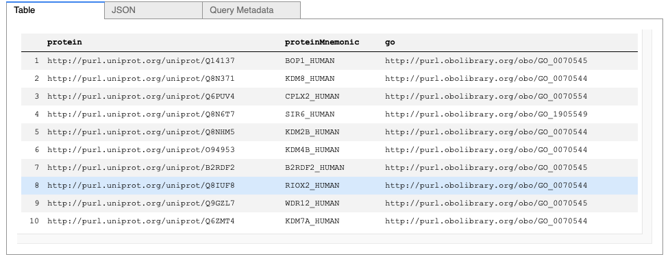


The query returns the proteins along with the respective GO IRI. Any proteins without a GO code will not be returned.

### Example 3: Filter proteins by GO description

We can further filter the proteins by pattern matching its GO description. For this query, we will list all the *Homo Sapiens* proteins classified with "*cholesterol biosynthetic process*". To do this, we  add a filter condition containing a regular expression of the GO label. We will also parse the GO IRI so it is easier to read in the  returned results.


```python
%%sparql
PREFIX rdfs: <http://www.w3.org/2000/01/rdf-schema#>
PREFIX taxon: <http://purl.uniprot.org/taxonomy/>
PREFIX up: <http://purl.uniprot.org/core/>
PREFIX go: <http://purl.obolibrary.org/obo/>
SELECT ?proteinMnemonic ?goCode ?label
WHERE {
    ?protein a up:Protein ;  
             up:mnemonic ?proteinMnemonic ;
             up:organism taxon:9606 ;
             up:classifiedWith ?go .                           
    ?go a owl:Class ;
        rdfs:label ?label .
    
    BIND(STRAFTER(STR(?go), "obo/") AS ?goCode)
    FILTER (REGEX(?label, "^cholesterol biosynthetic", "i"))
}
ORDER BY ?proteinMnemonic ?go
LIMIT 50
```

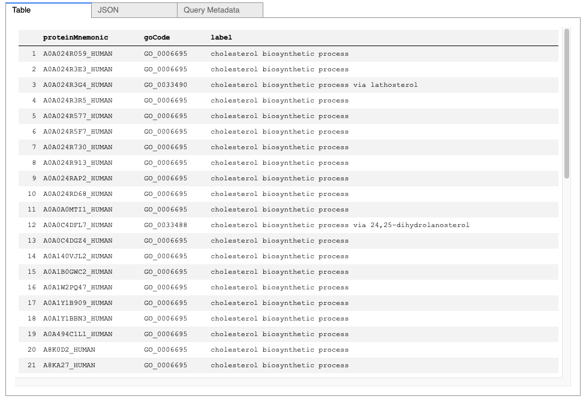


### Example 4: Find ancestor GO codes

We can also query the ancestor GO codes of proteins. Ancestor GO codes are represented by subclass relationships from a GO code to its ancestors. For example, GO code [0006695](https://www.ebi.ac.uk/QuickGO/term/GO:0006695) is termed as the *“cholesterol biosynthetic process”* and has a *subClassOf* relation to the GO codes [0008203](https://www.ebi.ac.uk/QuickGO/term/GO:0008203), termed the *“cholesterol metabolic process”*, and [1902653](https://www.ebi.ac.uk/QuickGO/term/GO:1902653), termed the *“secondary alcohol biosynthetic process”*.


```python
%%sparql
PREFIX rdfs: <http://www.w3.org/2000/01/rdf-schema#>
PREFIX taxon: <http://purl.uniprot.org/taxonomy/>
PREFIX up: <http://purl.uniprot.org/core/>
PREFIX go: <http://purl.obolibrary.org/obo/>
SELECT ?proteinMnemonic ?goCode ?ancestorGoCode ?ancestorLabel
WHERE {
    BIND(<http://purl.uniprot.org/uniprot/Q9UBM7> AS ?protein)
    ?protein up:mnemonic ?proteinMnemonic ;
             up:classifiedWith ?go .   
    
    ?go a owl:Class ;
        rdfs:label ?label ;
        rdfs:subClassOf ?ancestorGo .
    
    ?ancestorGo a owl:Class ;
        rdfs:label ?ancestorLabel .
    
    BIND(STRAFTER(STR(?go), "obo/") AS ?goCode)
    BIND(STRAFTER(STR(?ancestorGo), "obo/") AS ?ancestorGoCode)
    FILTER (REGEX(?label, "^cholesterol biosynthetic", "i"))
    
    MINUS {
       ?protein up:classifiedWith ?ancestorGo .
   }
}
ORDER BY ?proteinMnemonic ?go
```

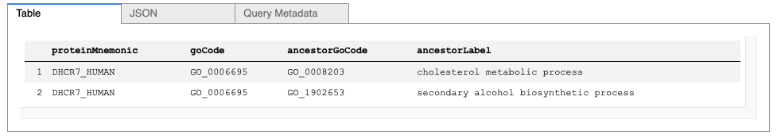


### Example 5:  Visualize a proteins Gene Ontology (GO)

To visualize the data for a protein in the "Graph" tab, we must construct a graph with the links between a protein and its GO codes and ancestor GO codes. We can create these relationships by using the [CONSTRUCT](https://www.w3.org/TR/sparql11-query/#construct) operation which returns a graph with selected triples. For this example, we will only show 20 of the GO codes for the [DHCR7](https://www.uniprot.org/uniprot/Q9UBM7) protein.


```python
%%sparql
PREFIX rdfs: <http://www.w3.org/2000/01/rdf-schema#>
PREFIX taxon: <http://purl.uniprot.org/taxonomy/>
PREFIX up: <http://purl.uniprot.org/core/>
PREFIX go: <http://purl.obolibrary.org/obo/>
PREFIX sc: <http://example.org/shortcuts/>

CONSTRUCT {
    ?protein rdfs:label ?proteinMnemonic ;
        up:classifiedWith ?go .
    
    ?go rdfs:label ?label ;
        rdfs:subClassOf ?ancestorGo .
    
    ?ancestorGo rdfs:label ?ancestorLabel .
} WHERE {
    BIND(<http://purl.uniprot.org/uniprot/Q9UBM7> AS ?protein)
    
    ?protein up:mnemonic ?proteinMnemonic ;
        up:classifiedWith ?go .
    
    ?go a owl:Class ;
        rdfs:label ?label ;
        rdfs:subClassOf ?ancestorGo .
    
    ?ancestorGo a owl:Class ;
        rdfs:label ?ancestorLabel .
    
    MINUS {
       ?protein up:classifiedWith ?ancestorGo .
   }
}
ORDER BY ?go
```

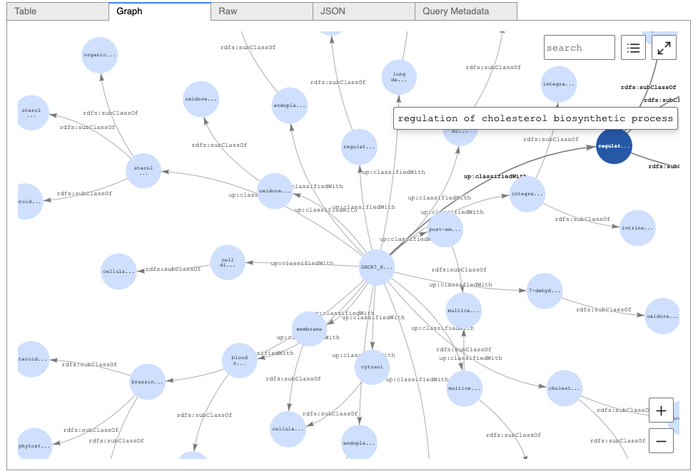


### Example 6: Adding data from Rhea to your Neptune Instance.

[Rhea](https://www.rhea-db.org/) is an expert-curated knowledgebase of chemical and transport reactions of biological interest, and the standard for enzyme and transporter annotation in UniProtKB. Here in this example, we will use the public [SPARQL endpoint of Rhea](https://sparql.rhea-db.org/sparql) to enrich your Neptune instance with data from Rhea using the CONSTRUCT operation.

Starting with protein [DHCR7_HUMAN](https://www.uniprot.org/uniprot/Q9UBM7), a reductase that catalyzes two reactions in the cholesterol biosynthetic pathway, we will demonstrate how to fetch the identifiers of all compounds that are metabolized by the enzyme (i.e. the chemical compounds of the enzyme-catalyzed reactions), and then create links between the protein in UniProtKB and the chemical compounds from Rhea. 

The Rhea data is an external data store, so we use a [federated query](https://www.w3.org/TR/2013/REC-sparql11-federated-query-20130321/) with the [SERVICE](https://www.w3.org/TR/2013/REC-sparql11-federated-query-20130321/) keyword.


```python
%%sparql
PREFIX rdfs: <http://www.w3.org/2000/01/rdf-schema#>
PREFIX rh: <http://rdf.rhea-db.org/>
PREFIX up: <http://purl.uniprot.org/core/>

CONSTRUCT {
    ?protein rdfs:label ?proteinMnemonic ;
        rh:chebi ?chemical .
    ?chemical rdfs:label ?label .
}
WHERE {
    BIND(<http://purl.uniprot.org/uniprot/Q9UBM7> AS ?protein)
    
    ?protein up:mnemonic ?proteinMnemonic ;
        up:annotation ?annotation .
    
    ?annotation a up:Catalytic_Activity_Annotation ;
        up:catalyticActivity/up:catalyzedReaction ?catalyzedReaction .
    
    SERVICE <https://sparql.rhea-db.org/sparql> {
        ?catalyzedReaction rdfs:subClassOf rh:Reaction ;
                  rh:status rh:Approved ;                
                  rh:side ?reactionSide .
        
        ?reactionSide rh:contains ?participant .       
        ?participant rh:compound ?compound .       
        ?compound rh:chebi ?chemical .
        ?chemical rdfs:label ?label .
    }
}
```

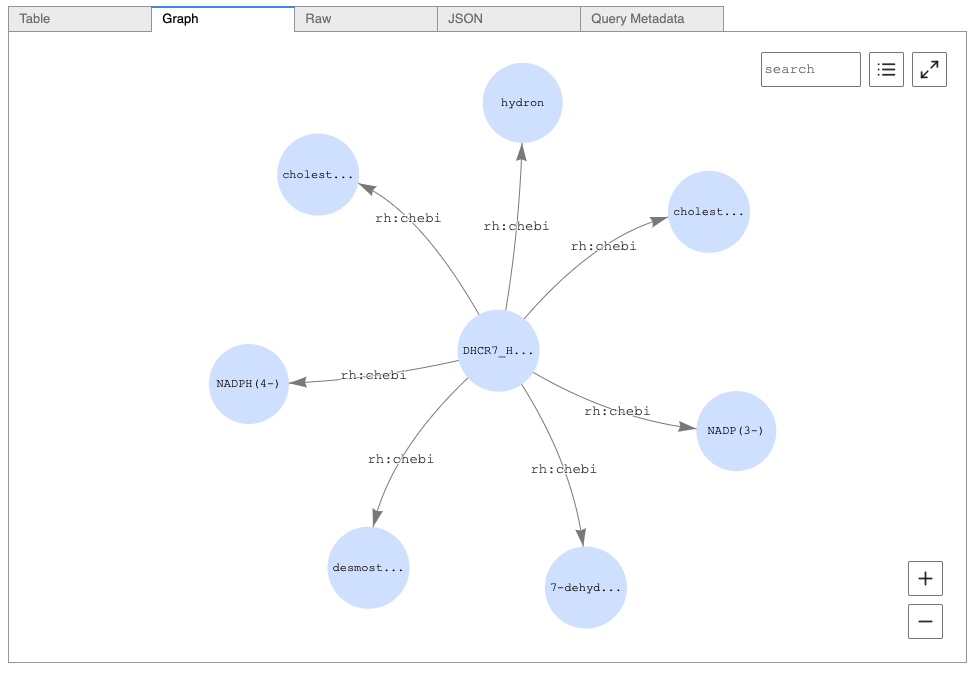


# Conclusion
In this example notebook, we have demonstrated some simple ways to create and use your own protein knowledgebase using the UniProt data available on AWS Open Registry of Data and Amazon Neptune. If you would like to explore further, you can easily run this yourself in your own account. Some other things to try would be joining to other graph databases using federated queries, querying features to train machine learning models, or inferring links with Neptune ML.


# **Danger Zone**

Use the following code to reset the database


```python
%db_reset
```
